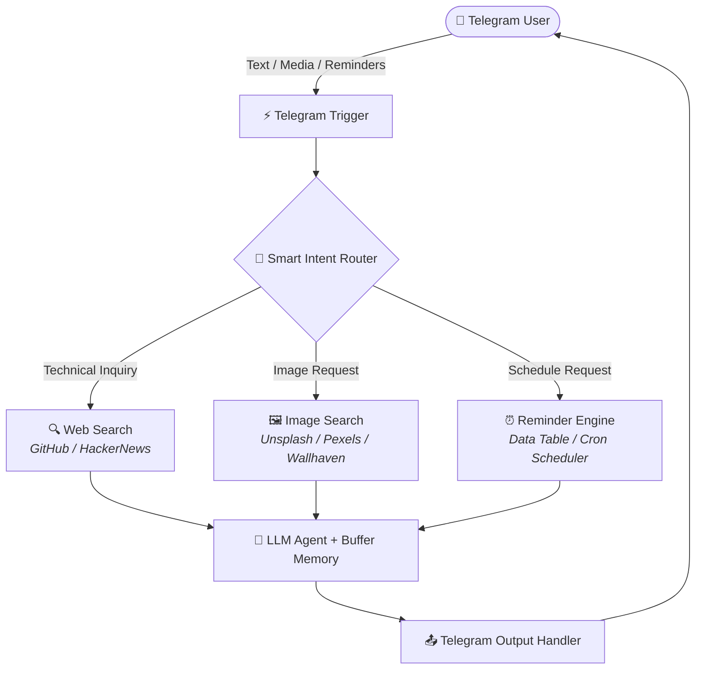

# 🤖 EvergardenAI — Multi-Modal Telegram AI Agent

[](https://n8n.io)
[](https://telegram.org)
[](https://opensource.org/licenses/MIT)

An advanced, multi-modal autonomous AI Assistant built with **n8n** and **Telegram**. It combines conversational memory, web research capabilities, image generation/retrieval, and automated reminder scheduling.

## ✨ Key Features

- 🧠 **Persistent Memory**: Maintains conversation context across messages using session-based memory buffers.
- 🖼️ **Multi-Modal Image Search**: Smart routing for images using Unsplash, Wallhaven (Anime), and Pexels (Stock & Assets).
- 🔍 **Real-Time Technical Research**: Automatically searches GitHub Repositories and Hacker News when user asks technical or coding questions.
- ⏰ **Automated Task Reminders**: Schedules dynamic one-time, daily, or monthly reminders via an integrated Data Table & Cron workflow.
- 🛡️ **Sanitized & Secure**: Fully detached credentials and sensitive IDs for safe production deployment.

## 🏗️ Architecture & Workflow Overview



## 🚀 Quick Start & Installation

### Prerequisites
- An active [n8n](https://n8n.io/) instance (Cloud, Self-Hosted, or Docker).
- Telegram Bot Token from [@BotFather](https://t.me/BotFather).
- OpenAI API Key (or supported LLM provider).

### How to Deploy
1. **Clone or Download** this repository.
2. Open your **n8n Dashboard**.
3. Create a new workflow and choose **Import from File**.
4. Import `workflows/main-agent.json` and `workflows/reminder-cron.json`.
5. Connect your credentials for **Telegram API** and **OpenAI API**.
6. Activate both workflows!

7. ## 📂 Repository Structure

```text
.
├── README.md               # Project documentation
├── .env.example            # Environment variables template
├── LICENSE                 # MIT License
└── workflows/
    ├── main-agent.json     # Main AI Telegram Agent Workflow
    └── reminder-cron.json  # Reminder Cron Scheduler Workflow
